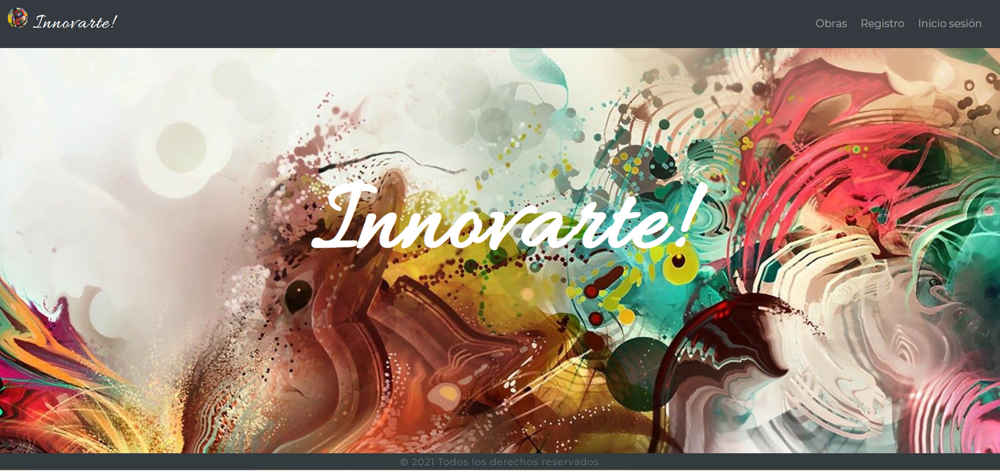

Update: Since this project I continue learning React and some of its frameworks. Reviewing this code today, I can see now how many errors I made. One of them is that I rely on  this.props and this.state for calculating the next state, when they may be updated asynchronously. 
Cart component needs a complete refactor, I will work on it soon. 

# **Innovarte-React-App**

E-commerce of artworks made with MERN stack. 
I used functional and class components from React, no hooks in this version.

## Install

- Run `npm i` on the root directory.
- You will need a data base and a Cloudinary account.

## API endpoints

### Artworks

| Method | Path   | Description |
| ------ | ------ | ----------- |
| `GET` | api/getAllArtworks | Get all the artworks |
| `GET` | api/getOneArtwork/:artwork_id | Get one artwork |
| `GET` | api/getUserArtworks/:artwork_id | Get all the user artworks |
| `GET` | api/getArtistArtworks/:artist | Get artworks by Artist |
| `GET` | api/getArtworksByTag/:tag | Get artworks by type |
| `GET` | api/getAvailableArtworks/:artwork_id | Get artworks on sell |
| `POST` | api/newArtwork | Add a new artwork |
| `PUT` | api/editArtwork/:artwork_id | Edit an artwork |
| `PUT` | api/artworkSold/:artwork_id | Update artwork state |
| `DELETE` | api/:artwork_id/deleteArtwork | Delete an artwork |

### Auth

| Method | Path   | Description |
| ------ | ------ | ----------- |
| `POST` | api/signup | Signup new user |
| `POST` | api/login | Login session |
| `POST` | api/logout | Logout session |
| `GET` | api/loggedin | Maintain session opened |

### User

| Method | Path   | Description |
| ------ | ------ | ----------- |
| `GET` | api/allUserArtworks/:user_id | Get the User's artworks |
| `GET` | api/soldArtworks/:user_id | Get the User's sold artworks |
| `GET` | api/onSellArtworks/:user_id | Get the User's on sell artworks |
| `GET` | api/cart/:user_id | Get the User's cart |
| `PUT` | api/editProfile/:user_id | Edit profile |
| `PUT` | api/addToCart/:user_id/:artwork_id | Add item to cart |
| `PUT` | api/deleteFromCart/:user_id/:artwork_id | Delete item from cart |
| `PUT` | api/updateBuyedArtworks/:user_id/:artwork_id | Update buyed artworks |

## Built With

- HTML5
- CSS - Bootstrap - Material UI
- JavaScript - ES6
- React.js.
- Node.js / Express.js
- Mongo DB / Mongoose

## Author

Silvana Cecilia Moreira